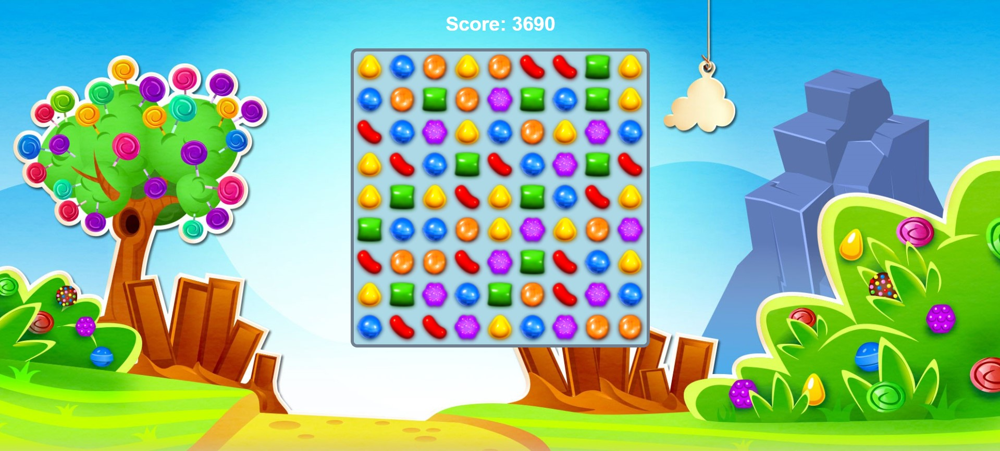

   

<h1 align="center">🍬 Candy Crush Game</h1>

  A fun and addictive Candy Crush game clone built using <strong>HTML</strong>, <strong>CSS</strong>, and <strong>JavaScript</strong>! 
  Match the candies, score high, and enjoy the colorful visuals — all in your browser.

<h2>🎮 Features</h2>
<ul>
  <li>Colorful candy graphics and smooth animations</li>
  <li>Score tracking and automatic tile refill</li>
  <li>Responsive design — playable on desktop and mobile</li>
  <li>No frameworks, just pure HTML, CSS, and JavaScript</li>
</ul>

<h2>🚀 How to Play</h2>
<ol>
  <li>Match 3 or more candies of the same type.</li>
  <li>Swapping adjacent candies will trigger matches.</li>
  <li>Matched candies disappear and new ones fall down.</li>
  <li>Score as many points as possible.</li>
</ol>

<h2>🛠️ Technologies Used</h2>
<ul>
  <li><strong>HTML5</strong> - Structure</li>
  <li><strong>CSS3</strong> - Styling and animations</li>
  <li><strong>JavaScript</strong> - Game logic and interactivity</li>
</ul>

<h2>🙌 Acknowledgments</h2>

  Inspired by the original Candy Crush game mechanics. 
  Designed and developed from scratch for learning and fun!

  Made with ❤️ by <strong>Fatima Khan</strong>

